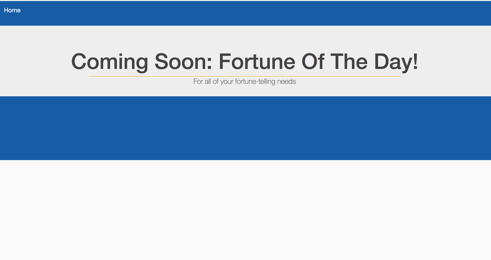

# Quotes As A Service (qaas)

A ridiculously overengineered cloud native application, managing all of your quote needs.

## Development

The project is managed inside of a Docker container. If you're using VSCode, as I am, you'll be able to remotely connect to this container automatically, otherwise you're able to build a container with an image based on `.dev/container/Dockerfile`. There are several development related commands available in the Makefile:

```
# compile the `qaas` executable
make build
# compile the `qaas` executable and move all website assets into /dist folder for deployment 
make build.all
# compile & run `qaas` with development options, for local testing over localhost:8080
make run
# remove the compiled binary and associated cache files
make clean
# run linter on project files
make lint
# run `go vet` on project files
make vet
# run tests on project files
make test
# lint, vet, test
make cicd
# generate & open html report on code coverage
make coverage.view
```

## Deployment
```
# create infrastructure, invoke cicd pipeline
make.tfall
```

## Architecture

This website is designed to be deployed to AWS, with the infrastructure specified in `deploy/terraform`. This infrastructure can be created with the `make tf.all` Makefile command. Terraform may be configured to save its state remotely, by uncommenting the commented lines in `deploy/terraform/main.tf` and applying the changes. This infrastructure employs a CICD pipeline to create a golden ami using Ansible and Packer. This ami is used as the base image for an autoscaling group spanning two availibility zones, which is then connected to an application load balancer. Systemd is used to manage the process and its sockets, provide logging, and sandboxing features to isolate from the rest of the system. Observability is gained by using [vector](timber.io) to forward the journald logs to cloudwatch, and the cloudwatch-agent to forward system metrics. HTTP handlers are instrumented using AWS X-Ray SDK. Instances are configured with ec2-instance-connect, and may be connected to using the `mssh <instance id>` cli utility. 

## Screenshots
